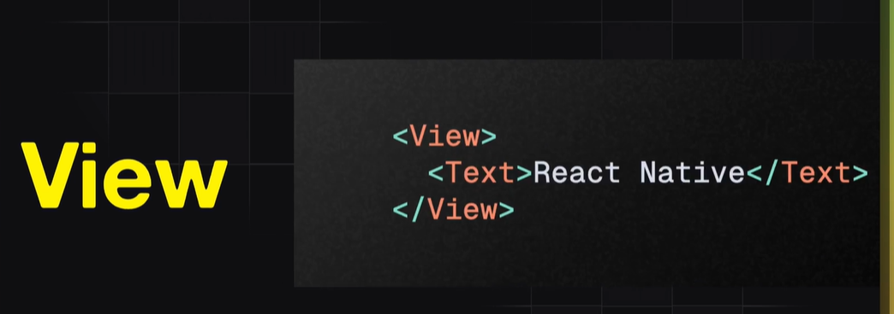
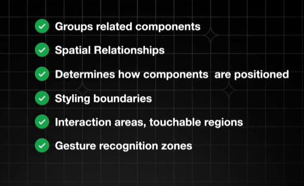
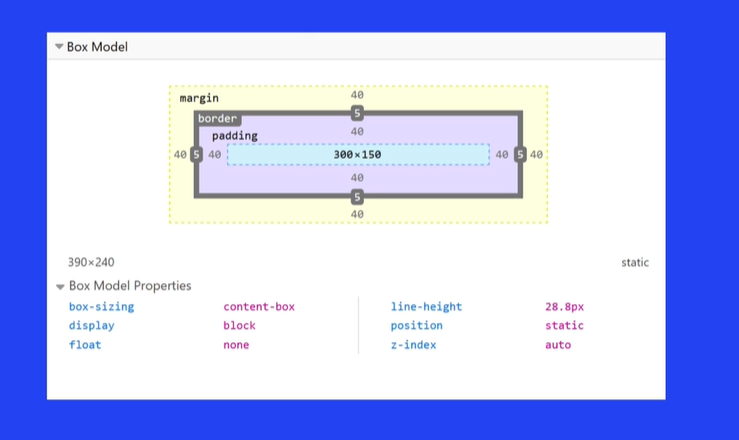
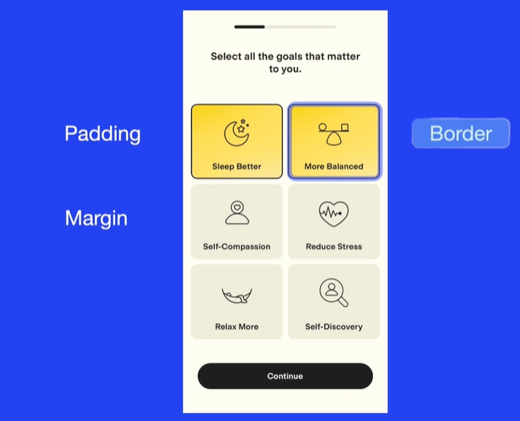
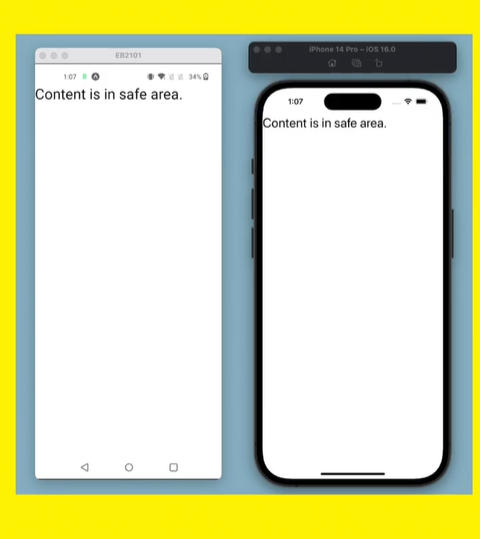

# Enhanced Text Component

* we have to modify text component using styles 

# View Introduction

* It gives a structure to an entire screen

# Essential Purpose

# View-Layout With Flex Box

* In this by default flex should be in column like 

* when we have to apply row for flex it should be look like 

* Justify content property controls alignment along vertical axis 
 
* Flex:1 expands to available place
 
# View-Positioning & Spacing

* 

* 

* SafeAreaView----->
* content should be in safe area like 

# View-Visual Styling
 
* In this applying different styles for screens like boarder,boarder width etc....

