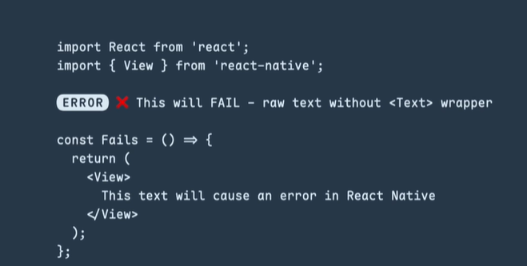
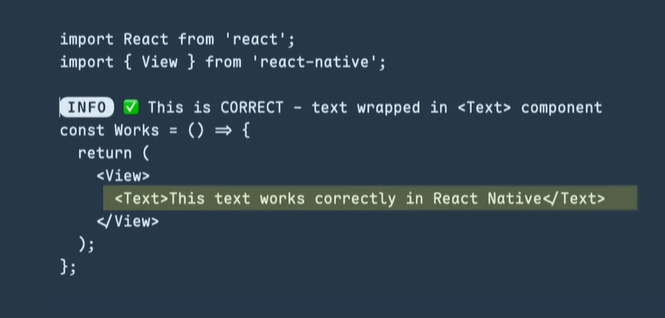

#  React Native Course – Day 1

### *Text Component *

This document explains the **React Native Text component**, its correct usage, essential props, styling techniques, and interactive behavior with clear examples.

---

##  Text Component Introduction

The **Text component** in React Native is used to display text on the screen.

###  Correct Way to Display Text

```jsx
<Text>React Native</Text>
```

> Unlike HTML, React Native **does not support plain text** outside the `<Text>` component.

###  Incorrect Usage

```jsx
React Native
```



###  Correct Usage

```jsx
<Text>React Native</Text>
```



---

##  Essential Core Props of Text Component

React Native provides several important props to control text behavior:

###  Commonly Used Props

* `style` → Used to apply custom styles
* `numberOfLines` → Controls how many lines the text can occupy
* `ellipsizeMode` → Defines how overflowing text is truncated
* `selectable` → Allows text selection
* `onPress` → Handles press events on text

---

###  `numberOfLines`

Limits the text to a specific number of lines.

```jsx
<Text numberOfLines={2}>
  This is a long paragraph that should only occupy two lines on the screen.
</Text>
```


---

###  `ellipsizeMode`

Determines how text is truncated when it exceeds the allowed lines.

#### Available values:

* `head`
* `middle`
* `tail` (default)
* `clip`

```jsx
<Text numberOfLines={1} ellipsizeMode="tail">
  This text will end with dots if it overflows
</Text>
```


---

##  Text Styling – Deep Dive

You can style text using the `style` prop.

###  Common Text Styling Properties

* `fontSize`
* `fontWeight`
* `color`
* `textAlign`
* `textDecorationLine`
* `letterSpacing`
* `lineHeight`

```jsx
<Text style={{ fontSize: 18, fontWeight: 'bold', color: '#333' }}>
  Styled Text
</Text>
```

---

##  Nested Text

React Native supports **nested Text components**, allowing **style inheritance**.

###  Style Inheritance Example

```jsx
<Text style={{ fontSize: 16 }}>
  Normal text
  <Text style={{ color: 'blue', fontWeight: 'bold' }}>
    Highlighted text
  </Text>
</Text>
```

* Child text automatically inherits parent styles unless overridden.

---

##  Interactive Text

The Text component can behave like a **button or link** using `onPress`.

```jsx
<Text style={{ color: 'blue' }} onPress={() => alert('Text pressed')}>
  Click Me
</Text>
```


